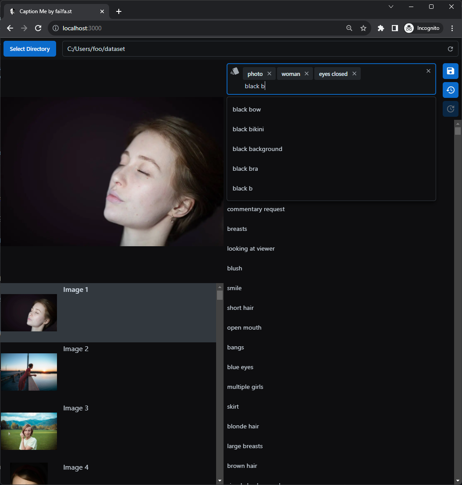

# Caption Me 📸


Easily manage, create, and update image captions with suggestions and autocomplete. Ideal for AI enthusiasts working with image datasets.

<!-- toc -->

- [Getting Started](#getting-started)
  * [Step by Step](#step-by-step)
  * [Quickstart](#quickstart)
    + [Windows Users](#windows-users)
    + [Everyone Else](#everyone-else)
- [Feedback & Support](#feedback--support)

<!-- tocstop -->

---

<p align="center">
  
</p>

[](https://discord.com/invite/m3TBB9XEkb)

## Getting Started

Getting "Caption Me" running on your machine is a breeze. Just follow these simple steps:

### Step by Step

1. **Clone the Repository**:
    ```bash
    git clone git@github.com:failfa-st/caption-me.git
    ```
2. **Enter the Project Directory**:
    ```bash
    cd caption-me
    ```
3. **Install the Needed Packages**:
    ```bash
    npm install
    ```
4. **Build the App**:
    ```bash
    npm run build
    ```
5. **Run the App**:
    ```bash
    npm start
    ```

### Quickstart

#### Windows Users
- **Install**: Double-click `install.bat`
- **Run**: Double-click `run.bat`

#### Everyone Else
- **Install**:
    ```shell
    npm install
    npm build
    ```
- **Run**:
    ```shell
    npm start
    ```

## Feedback & Support

Something not right? Have a cool idea? We value your feedback.

- Join our [Discord community](https://discord.com/invite/m3TBB9XEkb) to chat.
- Find an issue? Open an issue on GitHub.

Let's perfect "Caption Me" together! 🥳
