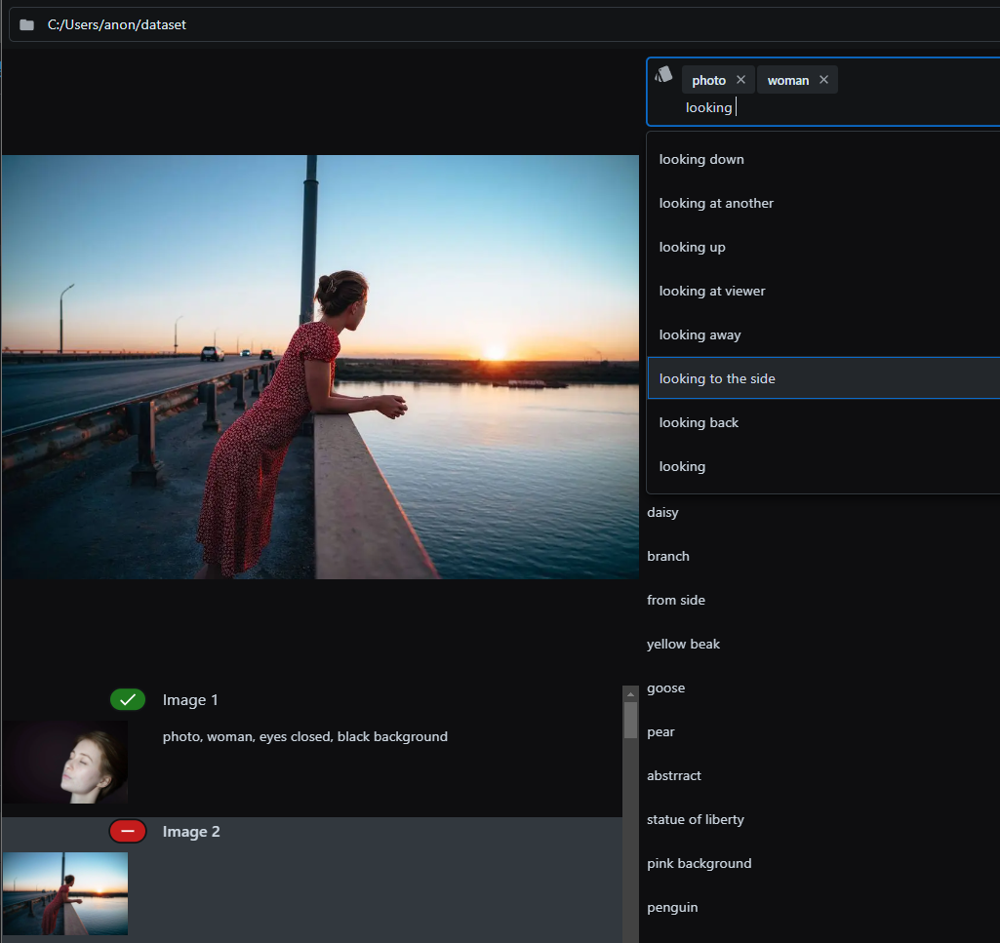
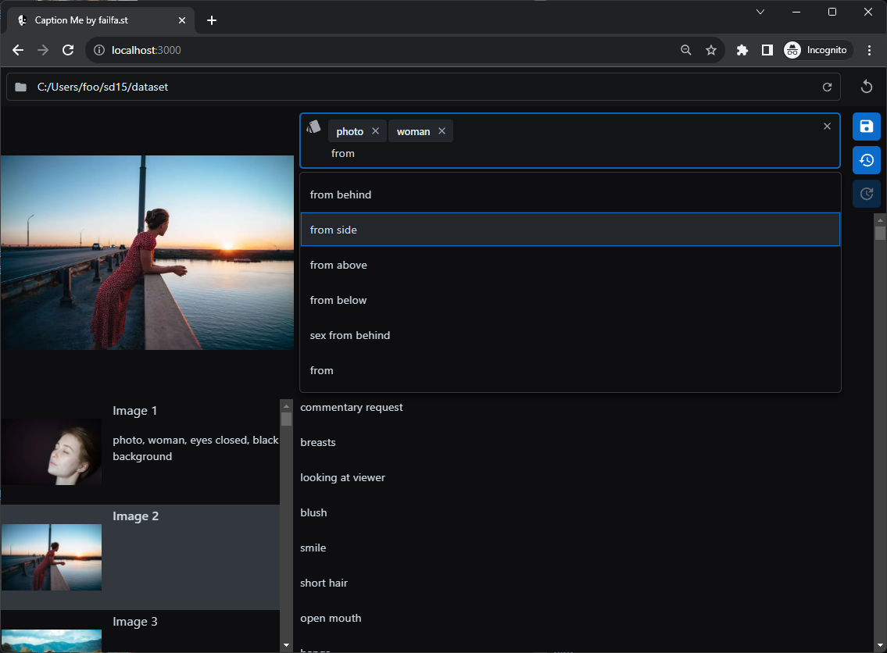
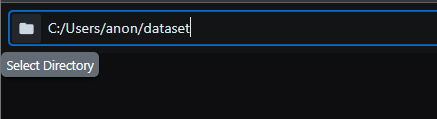
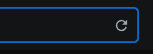
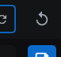
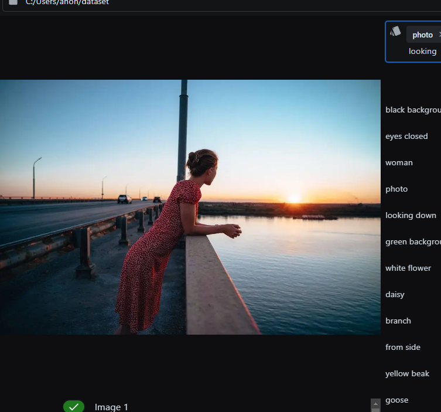
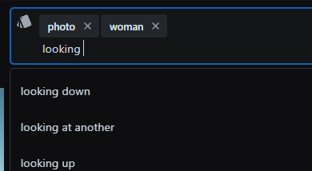
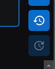
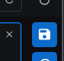

# Caption Me: Simplifying Image Captioning

**Caption Me** is designed to streamline the creation, management, and updating of image captions,
empowering you to focus on what really matters.

---

<div align="center">
  
  <p align="center"><i>collage style, woman, looking at viewer, torn paper, magazine, newspaper</i></p>
</div>

---

[](https://discord.com/invite/m3TBB9XEkb)

<!-- toc -->

- [Introduction](#introduction)
- [Prerequisites](#prerequisites)
- [Installation](#installation)
  * [Automated Installer (Windows)](#automated-installer-windows)
  * [Manual Setup](#manual-setup)
- [Quickstart](#quickstart)
  * [Clone repo](#clone-repo)
  * [Windows](#windows)
  * [macOS/Linux](#macoslinux)
- [Usage Guide: Mastering Caption Me](#usage-guide-mastering-caption-me)
  * [Navigating the Interface](#navigating-the-interface)
  * [Directory Selection](#directory-selection)
  * [Working with Images](#working-with-images)
  * [Captioning and Autocomplete](#captioning-and-autocomplete)
  * [Advanced Autocomplete Usage](#advanced-autocomplete-usage)
  * [Saving Your Work](#saving-your-work)
- [Feedback & Support](#feedback--support)

<!-- tocstop -->

---

<div align="center">
  
  <p align="center"><i>A modern interface dedicated to your captioning needs.</i></p>
</div>

---

## Introduction

**Caption Me** is built to simplify the image captioning process. Whether you're a professional or a
hobbyist, setting up Caption Me is straightforward and intuitive.

## Prerequisites

To ensure a seamless experience, please install the following software:

-   **Python 3**: Back-end operations
    -   [Download Python 3](https://www.python.org/downloads/)
-   **Node.js 18**: Dependency management
    -   [Download Node.js 18](https://nodejs.org/en/download/)
-   **Git**: Source code retrieval
    -   [Download Git](https://git-scm.com/downloads)

---

## Installation

### Automated Installer (Windows)

1. **Download**: Obtain the `one-click-installer.bat`
   [here](https://github.com/failfa-st/caption-me/releases/tag/v0.1.0-alpha.2).
2. **Execute**: Double-click the `.bat` file.
3. **Launch**: Open `run.sh` in the newly-created `caption-me` directory.

> **Note**: Re-running `one-click-installer.bat` updates the software. Store it separately for
> convenience.
>
> ```
> ├── caption-me-root
> │   ├── one-click-installer.bat
> │   └── caption-me (auto-generated)
> ```

### Manual Setup

For Unix-based systems, follow these instructions:

1. **Clone Repository**
    ```bash
    git clone git@github.com:failfa-st/caption-me.git
    ```
2. **Enter Directory**
    ```bash
    cd caption-me
    ```
3. **Install Dependencies**
    ```bash
    npm install
    ```
4. **Compile App**
    ```bash
    npm run build
    ```
5. **Run App**
    ```bash
    npm start
    ```

---

## Quickstart

### Clone repo

```bash
git clone git@github.com:failfa-st/caption-me.git
```

### Windows

-   **Install**: Double-click `install.bat`
-   **Run**: Double-click `run.bat`

### macOS/Linux

-   **One-liner**:
    ```bash
    npm install && npm run build && npm start
    ```

---
## Usage Guide: Mastering Caption Me

Caption Me is designed to be user-friendly, yet offers a range of features to facilitate your captioning process. Below is a detailed guide on how to get the most out of the tool.

---

### Navigating the Interface

When you launch Caption Me, you'll notice the main interface divided into specific sections for ease of use. Your working directory, image list, preview pane, and caption editor all have dedicated spaces.

<p align="center">
  
  <p align="center"><i>The user-friendly Caption Me Interface</i></p>
</p>

---

### Directory Selection

<p align="left">
  
</p>

1. **Select Directory**: To begin, either click the folder icon located at the left of the input field at the top or manually paste the directory path.
    - After entering the path, click the adjacent **load/reload** button.
      

2. **Reload Directory**: If you've made changes to the directory, such as adding or deleting images, click the **load/reload** button to refresh the image list.

3. **Clear Cache (optional)**: To ensure that the app recognizes new changes in the directory, especially new or deleted images, use the **clear cache** button next to the **load/reload** button.
   

---

### Working with Images


4. **Browse Image List**: Once a directory is loaded, you'll see a scrollable list of images on the left side of the interface. Each image listed here also displays its title and caption status.
    - A **red/green** indicator next to the image signifies whether a caption exists for that image.

<p align="center">
  
</p>


5. **Preview Image**: Above this image list is a preview pane where a larger version of the currently selected image will be displayed, aiding in more accurate captioning.  

<p align="center">
  
</p>

6. **Select an Image**: To work on a specific image, simply click on it from the list to load it into the preview pane and activate the caption editor.

---

### Captioning and Autocomplete


7. **Caption Editor**: Upon selecting an image, an autocomplete field activates. Begin typing your caption here.

<p align="center">
  
</p>


8. **Utilize Autocomplete**: As you type, the autocomplete feature suggests known terms to speed up your captioning process.

9. **Undo/Redo**: History functions, including **undo** and **redo**, are available next to the autocomplete field. These are cleared each time you switch to a different image. 
<p align="center">
   
</p>
### Advanced Autocomplete Usage

10. **Drag and Sort**: Within the autocomplete suggestions, you can **drag and sort** the listed terms to prioritize the ones you use most frequently.

11. **Batch Entry**: For a quicker way to insert multiple terms, you can type them in a single line, separated by commas. Once you press Enter, these will automatically be split into separate tags.

---

### Saving Your Work


12. **Automatic Save**: Caption Me automatically saves changes to the caption when you switch between images.

13. **Manual Save**: For explicit saving, click the **save icon** situated next to the history buttons.

<p align="center">
  
</p>


---

## Feedback & Support

We value your input. Reach out to us through these channels:

-   **Chat**: Engage with our [Discord community](https://discord.com/invite/m3TBB9XEkb).
-   **Issue Tracker**: Encountered a bug? Report it on
    [GitHub Issues](https://github.com/failfa-st/caption-me/issues).

---

Tailor your captioning experience with **Caption Me**. Thank you for choosing us.
